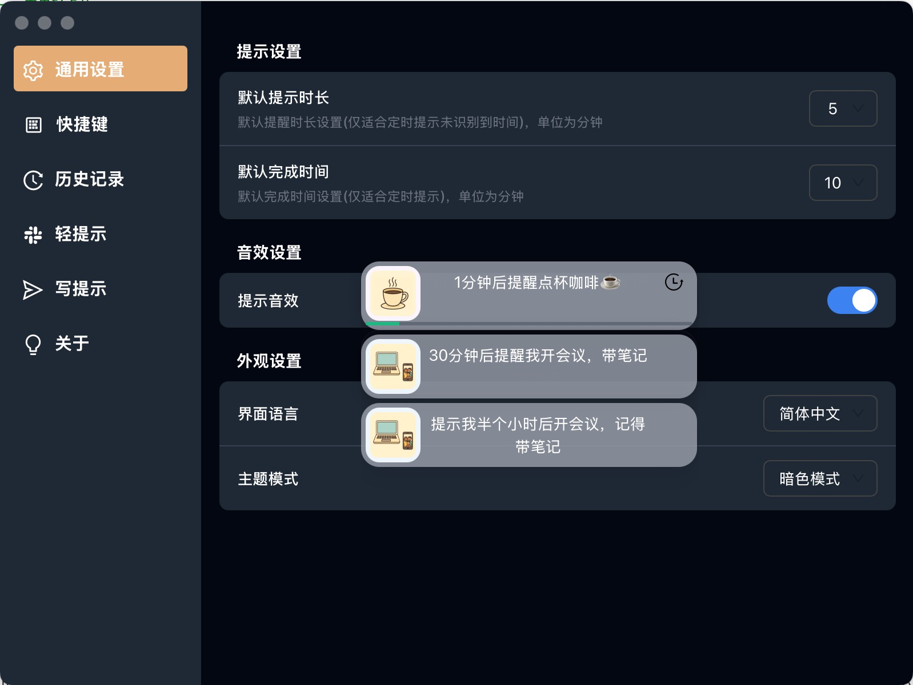
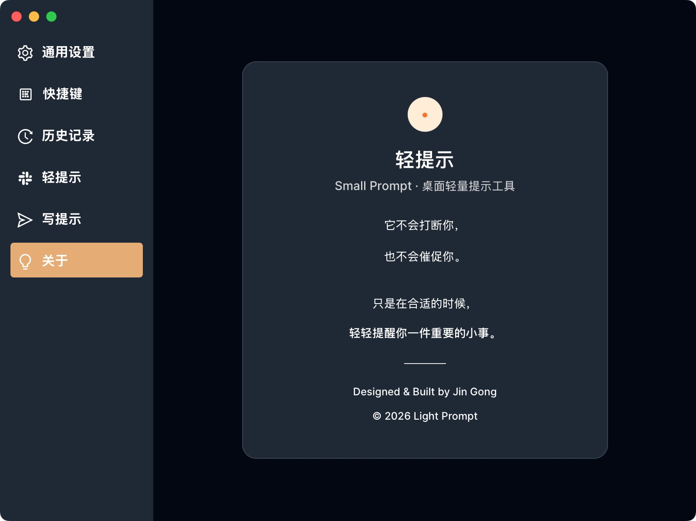
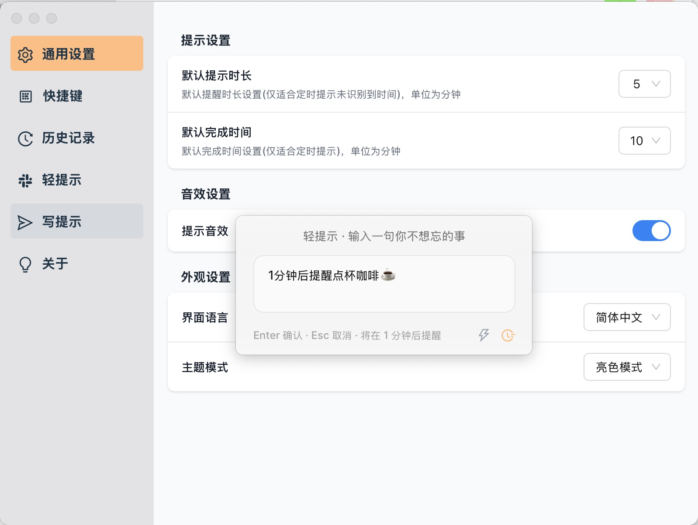
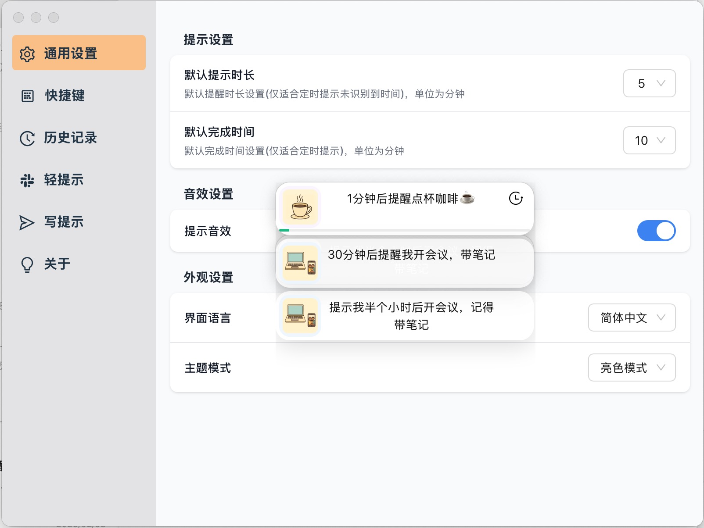
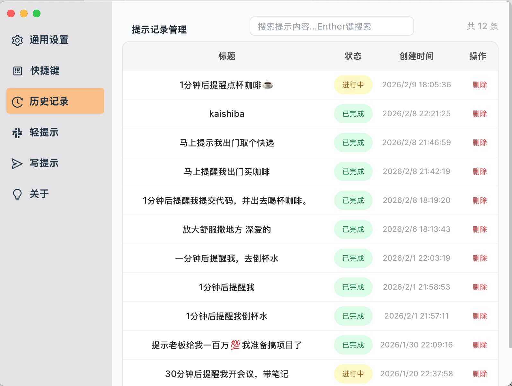
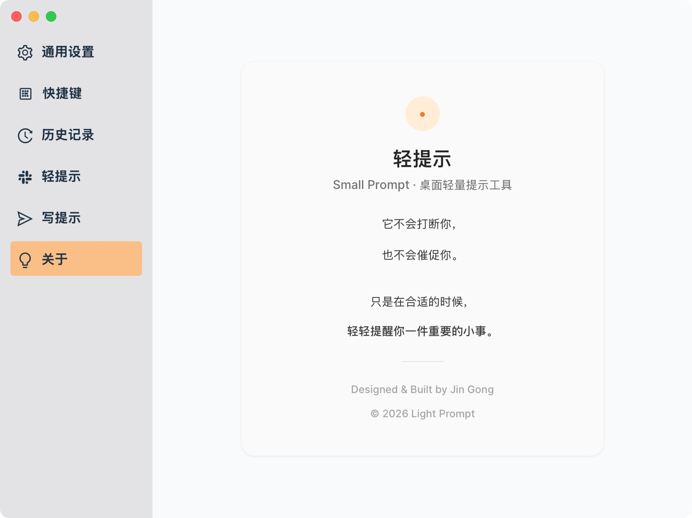
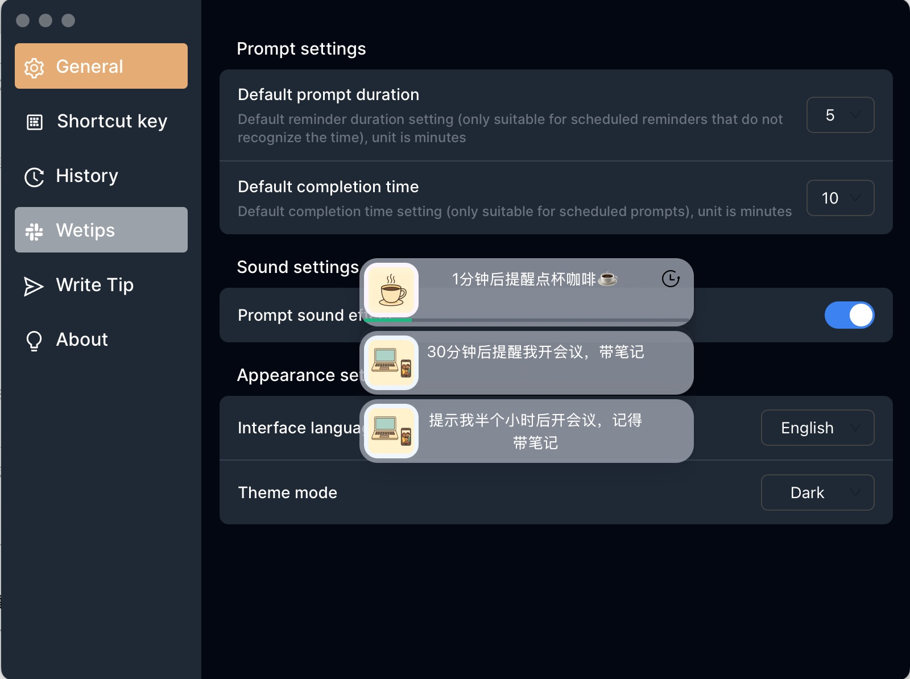
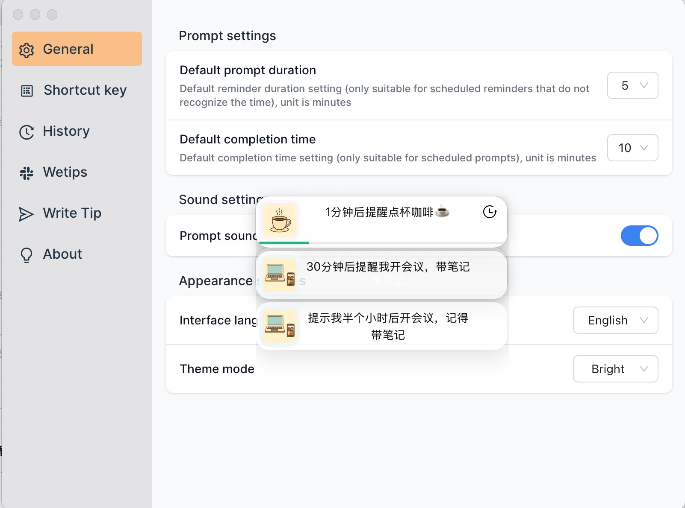

<p align="center"><h1 align="center">Small Prompt</h1></p>
<p align="center">
  <em>Small prompts, gently reminding you at just the right moment.</em><br/>
  <em>小而刚好的提示，轻而不打扰的提醒。</em>
</p>
<p align="center">
<a href="https://github.com/JinGongX/SuiDemo?tab=Apache-2.0-1-ov-file">

</a>
<a href="https://github.com/JinGongX/SuiDemo/releases">

</a>
 <a href="https://github.com/wailsapp/wails/tags" rel="nofollow">
    
  </a>
</p>
<p align="center"> 
  <a href="#简体中文">简体中文</a> ｜ <a href="#english">English</a>
</p>

## 简体中文

Small Prompt 是一款轻量级桌面应用，用于创建「小提示（Small Prompts）」与温和提醒。
它专注于 不打扰、低负担、刚刚好 的提示体验，而不是复杂的任务管理。

## ✨ 功能特性（Features）
	•	🪶 轻提示设计（Small Prompts）
非侵入式提示卡片，在合适的时间轻轻提醒你重要的小事。
	•	⏰ 灵活的时间调度
支持即时提示、定时提醒、延时（Snooze）等常见使用场景。
	•	✅ 状态管理
支持完成、过期等状态，保持提示列表清晰可控。
	•	🎨 简洁现代的界面
干净、轻量的 UI 设计，支持浅色 / 深色模式。
	•	🗂️ 本地优先（Local-first）存储
使用 SQLite 进行本地数据持久化，数据完全存储在用户设备中。
	•	🖥️ 跨平台桌面应用
基于 Wails v3 构建，使用 Go + Vue 3 + TypeScript，当前优先支持 macOS。

## 🖼️ 截图

<p align="center">
  
  
</p>
<p align="center">
  
  
  
  
</p>

## 🚀 快速开始（Getting Started）

环境要求
	•	Go
	•	Node.js
	•	Wails v3

本地运行
```bash
git clone https://github.com/yourname/small-prompt.git
cd small-prompt
wails3 dev
```

## 🛣️ 开发计划（Roadmap）

✅ 完成项
	•	⌨️ 全局快捷键（快速唤起 / 快速创建提示）
	•	🪟 多窗口支持（主窗口 / 偏好设置）
	•	⚙️ 偏好设置（提示样式、行为、快捷键）
	•	🌍 多语言支持（中文 / English）
🚧 计划中
	•	⚙️ 优化调度功能
	•	⌨️ 快捷键一键生成提示
	•	🎨 主题多样化（扩展主题和进度条的样式）	
	•	🔄 应用内自动更新

💡 未来想法
	•	🧠 更智能的提示规则
	•	📊 本地使用统计（不上传）
	•	☁️ 可选的云同步（多设备）

## 📦 技术栈

	•	Backend: Go
	•	Frontend: Vue 3 + TypeScript
	•	Desktop Framework: Wails v3
	•	Database: SQLite

## 📜 许可证

Apache-2.0 License

## 🌱 项目状态

Small Prompt 目前处于早期开发阶段，功能和体验仍在持续演进中，欢迎反馈与建议。

## 🤝 参与贡献（Contributing）

欢迎任何形式的贡献，包括但不限于：
	•	Bug 修复
	•	新功能建议
	•	UI / UX 改进
	•	文档优化

你可以：
	1.	Fork 本仓库
	2.	创建新分支
	3.	提交 Pull Request

如果你对这个项目感兴趣或有任何建议，欢迎提 issue 或发邮件联系我 ggfugg8@icloud.com

## English

Small Prompt is a lightweight desktop application designed for creating small prompts and gentle reminders.
It focuses on a non-intrusive, low-friction, just-enough reminder experience rather than heavy task management.

## ✨ Features
	•	🪶 Small Prompt Design
Non-intrusive prompt cards that gently remind you of important things at the right time.
	•	⏰ Flexible Scheduling
Supports instant prompts, scheduled reminders, and snooze-based delays.
	•	✅ State Management
Manage prompts with completed and expired states to keep your list clear and organized.
	•	🎨 Clean & Modern UI
A lightweight interface with support for light and dark modes.
	•	🗂️ Local-first Storage
Uses SQLite for local persistence. All data stays on your device.
	•	🖥️ Cross-platform Desktop App
Built with Wails v3 using Go, Vue 3, and TypeScript, with macOS as the primary platform.

## 🖼️ Screenshots

<p align="center">
  
  
</p>


## 🚀 Getting Started

Requirements
	•	Go
	•	Node.js
	•	Wails v3

Run locally
```bash
git clone https://github.com/yourname/small-prompt.git
cd small-prompt
wails3 dev
```

## 🛣️ Roadmap

✅ Completed
	•	⌨️ Global shortcuts (quick launch / quick prompt creation)
	•	🪟 Multi-window support (main window / preferences)
	•	⚙️ Preferences (prompt styles, behavior, shortcuts)
	•	🌍 Internationalization (Chinese / English)

🚧 Planned
	•	⚙️ Scheduling improvements
	•	⌨️ One-key prompt creation via shortcuts
	•	🎨 Theme expansion (themes and progress bar styles)
	•	🔄 In-app auto updates

💡 Future Ideas
	•	🧠 Smarter prompt rules
	•	📊 Local usage analytics (privacy-first)
	•	☁️ Optional cloud sync across devices

## 📦 Tech Stack
	•	Backend: Go
	•	Frontend: Vue 3 + TypeScript
	•	Desktop Framework: Wails v3
	•	Database: SQLite

## 📜 License

Apache-2.0 License

## 🌱 Project Status

Small Prompt is currently in early development.
Features and user experience are actively evolving, and feedback is welcome.

## 🤝 Contributing

Contributions are welcome, including but not limited to:
	•	Bug fixes
	•	Feature suggestions
	•	UI / UX improvements
	•	Documentation enhancements

You can:
	1.	Fork this repository
	2.	Create a new branch
	3.	Submit a Pull Request

	If you find this useful or have suggestions, feel free to open an issue or reach out.
Email: ggfugg8@icloud.com